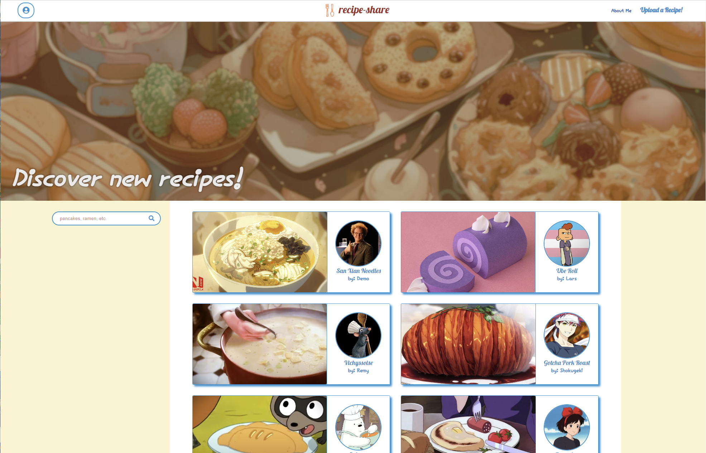
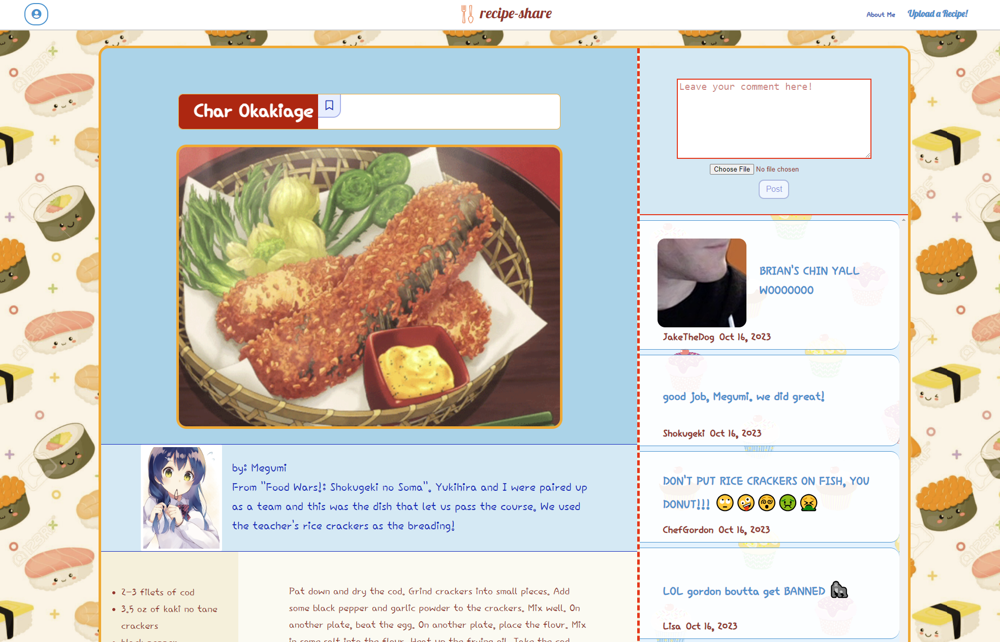
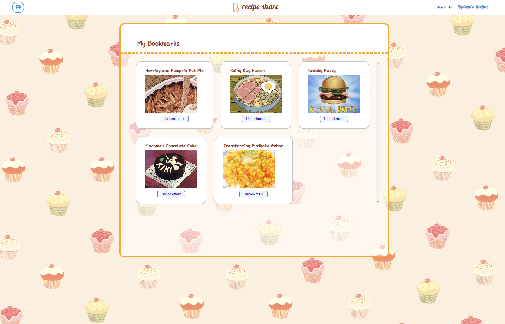

# recipe-share

A place to share recipes, especially those from popular shows or movies.  Get excited about cooking!

Check out [recipe-share](https://recipe-share-8aoq.onrender.com) and join the party.

## Index
[MVP Feature List](https://github.com/lypark5/capProject/wiki/Features) |
[Database Schema](https://github.com/lypark5/capProject/wiki/DB-Schema-Diagram-&-Schema) |
[User Stories](https://github.com/lypark5/capProject/wiki/User-Stories) |
[Store Shape](https://github.com/lypark5/capProject/wiki/Store-Shape)

## Technologies Used

## All Recipes Page

## Recipe Detail Page

## My Bookmarks Page

## Getting started
1. Clone this repository:
    * `https://github.com/lypark5/capProject.git`

2. Install dependencies into the Backend by running the following:
    * `pipenv install`

3. Install dependencies into the Frontend by cd into `react-app` and running the following:
    * `npm install`

4. Create a **.env** file using the **.envexample** provided

5. Set up your database with information from your .env and then run the following to create your database, migrate, and seed:
    * `pipenv run flask db migrate`
    * `pipenv run flask db upgrade`
    * `pipenv run flask seed all`

6. Start the app for backend using:
    * `pipenv run flask run`

7. Start the app for frontend by cd into `react-app` and running:
    * `npm start`

8. Now you can use the `Demo User` button to log in or Create an account

***

# Features

## Recipes
Logged-in users can:
* post a recipe
* read/view other users' recipes
* update their recipes
* delete their recipes

## Comments
Logged-in users can:
* post a comment for a recipe under the recipe details page, may include a photo
* read/view other users' comments under the recipe details page
* update their comments
* delete their comments

## Bookmarks
Logged-in users can:
* bookmark & unbookmark a recipe by clicking the bookmark / unbookmark icon on the recipe details page
* unbookmark a recipe by clicking the unbookmark button on the my bookmarks page

# Connect
* Ludia Park [GitHub](https://github.com/lypark5) [LinkedIn](https://www.linkedin.com/in/ludia-park-172496293/)